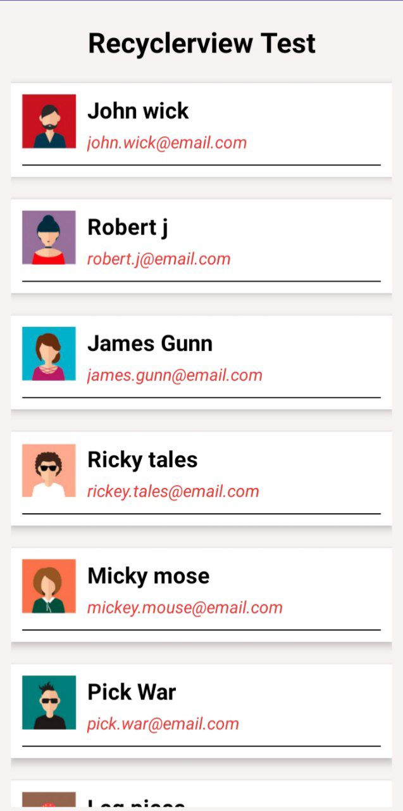

## Android RecyclerView Example

This is the example of Android RecyclerView created using Android Studio Software.

## Software Used

##  Youtube
<h4>If you like, do follow me on Youtube</h4>
<a href="https://www.youtube.com/@Code-With-Vishal">Connect with me on  Youtube</a>

##  Instagram
<h4>If you like, do follow me on Instagram</h4>
<a href="https://www.instagram.com/monstrvishal">Connect with me on Instagram</a>

## License

This project is licensed under the MIT License.
